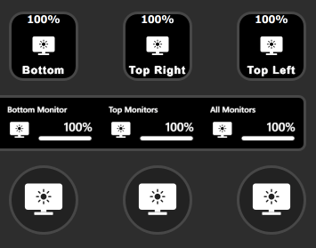
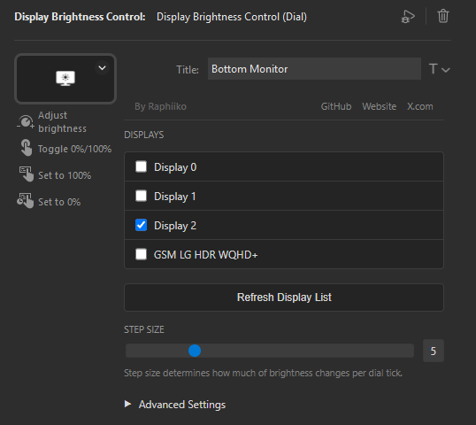
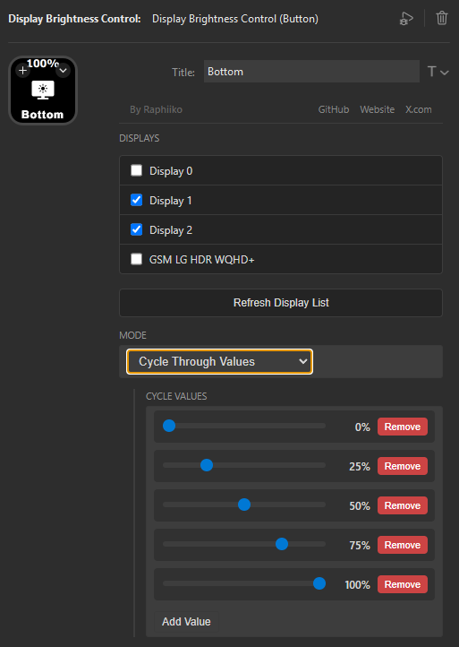

<picture>
  <source media="(prefers-color-scheme: dark)" srcset="docs/logo_dark.png">
  <source media="(prefers-color-scheme: light)" srcset="docs/logo_light.png">
  
</picture>

Control the brightness of your displays directly from your Stream Deck using [DDC/CI](https://en.wikipedia.org/wiki/Display_Data_Channel) (Display Data Channel).

## Features

<table>
<tr>
<td width="50%">

- **Dial Control**: Adjust brightness by rotating a Stream Deck dial
- **Button Control**: Quick brightness presets or cycle through values with button presses
- **Multi-Monitor Support**: Control individual monitors or multiple monitors at once

</td>
<td width="50%">

</td>
</tr>
</table>

## Actions

### Display Brightness Control (Dial)

For devices like the Stream Deck+ with built-in dials. Rotate to adjust brightness, tap for quick actions.

<table>
<tr>
<td width="50%">

**Features:**

- Control individual displays or multiple displays at once
- Rotate the dial to adjust display brightness
- Press the dial to toggle between 0% and 100% brightness
- Tap display for 100% brightness
- Hold display for 0% brightness
- Customizable step size

</td>
<td width="50%">

</td>
</tr>
</table>

### Display Brightness Control (Button)

Works with any Stream Deck model. Choose from multiple modes to control your brightness.

<table>
<tr>
<td width="50%">

**Available Modes:**

- **Cycle Through Values**: Press to cycle through preset brightness levels (e.g., 0%, 25%, 50%, 75%, 100%)
- **Set to Value**: Set brightness to a specific percentage when pressed
- **Toggle**: Toggle between two configurable brightness values
- **Increase/Decrease**: Increment or decrement brightness by a fixed step

Control individual displays or all monitors at once.

</td>
<td width="50%">

</td>
</tr>
</table>

## Requirements

- Stream Deck software (version 6.0 or later)
- Windows operating system
- Monitor(s) that support DDC/CI control

**Note**: Most modern monitors support DDC/CI, but some may require enabling it in the monitor's OSD menu.

## Troubleshooting

**Monitor not appearing in the list?**

- Ensure DDC/CI is enabled in your monitor's settings (usually in the OSD menu)
- Try clicking the **Refresh Display List** button
- Some monitors may not support DDC/CI control

**Brightness not changing?**

- Verify your monitor supports DDC/CI
- Check that your monitor is connected via DisplayPort, HDMI, or DVI (USB-C monitors may have limited support)
- Try adjusting the step size in the settings

## License

MIT License - see LICENSE file for details

## Support

Found a bug or have a feature request? Please open an issue on [GitHub](https://github.com/Raphiiko/sd-brightness/issues).
